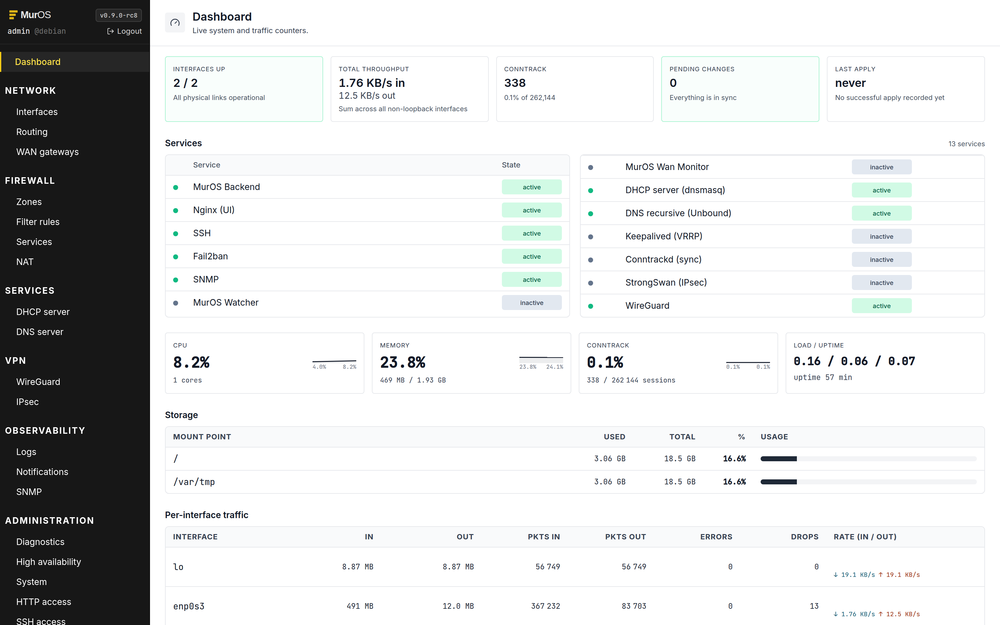

# MurOS

[](https://github.com/murosorg/muros/releases)
[](https://github.com/murosorg/muros/actions)
[](LICENSE)
[](https://www.debian.org/)
[](https://wiki.nftables.org/)
[](https://muros.org)

Website: [muros.org](https://muros.org)

A firewall appliance built on Debian 13, with every network service
built natively on top and managed from a single web UI. An open source
alternative to pfSense and OPNsense. Web-managed, Debian-native, zero
subscription. Covers the 90% of small and mid-size business needs:
stateful filtering, NAT, routing, multi-WAN, VPN (WireGuard + IPsec),
high availability, DHCP, recursive DNS, SNMP, monitoring.



## Why MurOS

- **Pure Debian, no fork.** Boots, behaves and debugs like a regular
  Debian 13 box. `journalctl`, `nft`, `ip`, `systemctl` are the tools you
  already know, not a custom CLI on top of FreeBSD like pfSense or OPNsense.
- **Single source of truth in SQLite.** The UI, the API and the boot-time
  applier all read from the same DB. No more drift between the running
  config and what some `.conf` file says.
- **Dry-run by default.** Every change is staged in DB first. The kernel
  push only happens when you click Apply, and bad rulesets auto-rollback.
  Try things without losing access to the box.
- **Drop-ins over file rewrites.** When a daemon supports drop-ins (sshd,
  fail2ban, snmpd, swanctl, Kea, unbound...) MurOS uses them. Your
  native Debian config is untouched and visible.
- **One install command.** No appliance image, no custom kernel, no
  proprietary update channel. Just `apt install muros` on a fresh Debian.
  The UI listens on 443, and you only open the other ports the
  features you enable need (SSH, SNMP, VRRP, WireGuard, IPsec, ...).

## Tech stack

`Debian 13`  ·  `Python 3.12 / FastAPI / SQLite`  ·  `React 18 / Vite / Tailwind`
·  `nftables`  ·  `nginx`  ·  `WireGuard + StrongSwan`  ·  `keepalived + conntrackd`
·  `kea + unbound`  ·  `fail2ban + snmpd`

## Quick start

Prerequisites: a freshly installed Debian 13 machine with root access and
one reachable interface.

```bash
curl -fsSL https://apt.muros.org/install.sh | sudo bash
```

The installer registers the signed apt repository (`https://apt.muros.org`)
and installs the package, so later upgrades are just
`apt update && apt install --only-upgrade muros`. To add the repository
by hand instead (for example on a host that already runs MurOS):

```bash
curl -fsSL https://apt.muros.org/muros.asc | sudo gpg --dearmor -o /usr/share/keyrings/muros-archive-keyring.gpg
echo "deb [signed-by=/usr/share/keyrings/muros-archive-keyring.gpg] https://apt.muros.org stable main" | sudo tee /etc/apt/sources.list.d/muros.list
sudo apt update
sudo apt install muros
```

Open `https://<firewall-ip>` in a browser. Default credentials:

- Login: `root`
- Password: `muros` (the UI forces a password change on first login)

To pin a specific version: `MUROS_VERSION=0.9.0-rcXX sudo bash` (the repo
keeps only the latest version, so pinning works for the current release).
To remove cleanly: `curl -fsSL https://apt.muros.org/uninstall.sh | sudo bash`.

## Positioning

MurOS targets the 90% of small and mid-size businesses whose actual
firewall needs are network plumbing (filter, NAT, route, VPN, HA), not
the full NGFW catalogue.

| Capability | FortiGate | pfSense | OPNsense | **MurOS** |
| --- | :-: | :-: | :-: | :-: |
| Stateful firewall (nft) | yes | yes | yes | **yes** |
| NAT (SNAT / DNAT) | yes | yes | yes | **yes** |
| Static routing | yes | yes | yes | **yes** |
| Dynamic routing (OSPF / BGP) | yes | yes (FRR) | yes (FRR) | planned |
| IPsec site-to-site | yes | yes | yes | **yes** |
| WireGuard | recent | yes | yes | **yes** |
| HA (VRRP, active-passive) | yes | yes | yes | **yes** |
| Multi-WAN failover | yes | yes | yes | **yes** |
| DHCP server | yes | yes | yes | **yes** |
| DNS server (recursive) | yes | yes | yes | **yes** |
| IDS / IPS (Suricata) | yes | package | yes | planned |
| SNMP / monitoring | yes | yes | yes | **yes** |
| External auth (LDAP / RADIUS) | yes | yes | yes | planned |

Features still on the roadmap (OSPF / BGP, IDS / IPS, external auth) are
marked as planned above. Everything that ships is built natively into the
core, with no plugins to add.

MurOS is a Linux-based alternative to pfSense and OPNsense, built on a
Debian-native base: Linux admins debug with their existing tools instead
of learning FreeBSD-specific paths.

## Modules

| Domain | Features |
| --- | --- |
| Filtering | Zones, interfaces (IP, VLAN, MTU), nft rules (input / forward / output), rate-limit, log, live per-rule packets / bytes counters |
| NAT | SNAT, DNAT, masquerade, redirects, drag-and-drop reorder |
| Routing | Static routes, main table |
| Multi-WAN | Multiple WAN gateways, ICMP probes, automatic failover with default-route swap |
| DHCP server | Kea (kea-dhcp4-server) backend, per-interface pools, static leases by MAC, active lease view |
| DNS recursive | Unbound resolver, DNSSEC, forwarders, local A / AAAA records, optional system resolver |
| WireGuard | Config + peers, install via UI, reboot persistence |
| IPsec | PSK or cert connections, integrated PKI (CA + certs + CRL), 3-tab UI (connections / certificates / users) |
| HA | VRRP, conntrackd, VIPs, inter-node DB sync, automatic takeover |
| Notifications | SMTP mail + event watcher + configurable postfix relay (smarthost) |
| SNMP | standard Debian snmpd, community, CIDR ACL, sysContact / Location |
| Backups | Local DB snapshot, restore, remote (rclone, ftp, ssh) |
| Diagnostic | ping, traceroute, dig, tcpdump, conntrack from the UI |
| Logs | Firewall logs (journalctl -k) + audit log of all UI actions |
| System | Hostname, DNS, NTP, apt updates, reboot / shutdown |
| TLS UI | Certificate upload or RSA 4096 self-signed generation |
| SSH | Install, listen address, port, authorized keys, Linux root password |
| HTTP nginx | Listen interface + ports + HTTP -> HTTPS redirect |
| Hardening | sysctl, sshd, fail2ban, journald (clean drop-ins) |
| Admin account | Login + password + policy (12+ chars, complexity, anti-leaks), TOTP MFA |

## Architecture: source of truth in SQLite

MurOS uses **drop-ins** when the service supports them, and regenerates the
full file otherwise. The DB is the source of truth and the only thing you
need to back up.

```
/etc/sysctl.d/99-muros-hardening.conf      sysctl drop-in
/etc/ssh/sshd_config.d/muros.conf          sshd drop-in (UI-regenerated)
/etc/systemd/journald.conf.d/muros.conf    journald drop-in
/etc/fail2ban/{filter.d,jail.d}/muros*     fail2ban drop-in
/etc/snmp/snmpd.conf.d/muros.conf          snmpd drop-in
/etc/swanctl/conf.d/muros.conf             strongswan drop-in
/etc/kea/kea-dhcp4.conf                    Kea DHCPv4 config
/etc/unbound/unbound.conf.d/muros.conf     unbound drop-in (recursive DNS)
/etc/nftables.conf                         fully generated by MurOS
/etc/keepalived/keepalived.conf            fully generated
/etc/wireguard/wg0.conf                    fully generated
/etc/nginx/sites-available/muros           regenerated by HTTP Access UI
/opt/muros/                                code (backend + built frontend)
/var/lib/muros/                            SQLite DB, JWT key, backups
```

MurOS **never writes** to `/etc/network/interfaces`, `/etc/systemd/network/`
nor `/etc/netplan/`. Interfaces, VLANs and routes are replayed from the DB
at boot by a dedicated `muros-boot.service` ordered before
`network-online.target`. Same pattern as pfSense / OPNsense: saving the DB
saves the entire network config.

## API

The UI consumes a complete REST API under `/api/*` with JWT Bearer
authentication. Auto-generated OpenAPI doc at `https://<firewall>/docs`.

```bash
TOKEN=$(curl -sk -X POST https://firewall/api/auth/login \
  -H 'Content-Type: application/json' \
  -d '{"username":"admin","password":"mypass"}' | jq -r .access_token)

curl -sk https://firewall/api/firewall/rules \
  -H "Authorization: Bearer $TOKEN"
```

JWT tokens are valid 8h max (no permanent tokens for scripts).

## Local development

```
make install   # creates the Python venv and installs npm packages once
make backend   # terminal 1: FastAPI on :8000
make frontend  # terminal 2: Vite dev server on :5173
```

- Frontend dev: <http://localhost:5173> (proxies `/api` to `:8000`)
- Direct API: <http://localhost:8000/api/health>
- Swagger: <http://localhost:8000/docs>

## Documentation

See the [`docs/`](docs/) folder:

- [Concepts](docs/concepts.md): zones, rules, NAT, VPN
- [First filter](docs/first-filter.md): typical use case
- [FAQ and troubleshooting](docs/faq.md)

## Roadmap

Delivered features move to [`CHANGELOG.md`](CHANGELOG.md). Current state:

- **V1.0** (beta, current rc cycle): Stateful filtering, NAT, routing, VLAN,
  WireGuard + IPsec, HA, logs, monitoring, backups, SNMP, notifications,
  hardening, apt updates, multi-WAN failover, built-in DHCP (Kea) and
  recursive DNS (Unbound), GitHub Actions CI. Pending before stable: appliance
  ISO, signed apt repository.
- **V2.0** (planned): IPS / IDS Suricata, captive portal, LDAP / AD
  integration, multi-user with roles, WireGuard self-service via LDAP, NTP, 2FA, OpenVPN, Kea

### Out of scope, by design

SD-WAN with application steering, HTTP proxy / web filter with HTTPS
interception, gateway antivirus, dynamic routing (OSPF / BGP), reverse
proxy / HTTP load balancer, OpenVPN, non-Debian distributions.

## About the name

MurOS is unrelated to **Murus**, the commercial macOS firewall front-end
developed by The Murus Team and distributed at
<https://www.murusfirewall.com/>. Both names derive from Latin *murus*
(wall), which is a natural root for any firewall project, and the
phonetic proximity is purely coincidental.

The two projects target completely different platforms and audiences:

- **Murus** is a closed-source GUI for the macOS built-in PF packet
  filter, sold per seat to individual Mac users who want a graphical
  way to configure the firewall on their workstation.
- **MurOS** is an open source firewall appliance built on Debian and
  nftables, designed to replace pfSense or OPNsense as a network
  gateway for small and mid-size businesses, managed entirely through
  a web interface.

The canonical spelling of this project is **MurOS** (with a capital
`OS` suffix) to underline that it ships an entire operating system,
not just an application. Please respect that capitalization when
referring to the project.

## License

MurOS is distributed under the **GNU AGPL v3.0 or later**.
See [`LICENSE`](LICENSE) for the full text.

## Issues

<https://github.com/murosorg/muros/issues>
