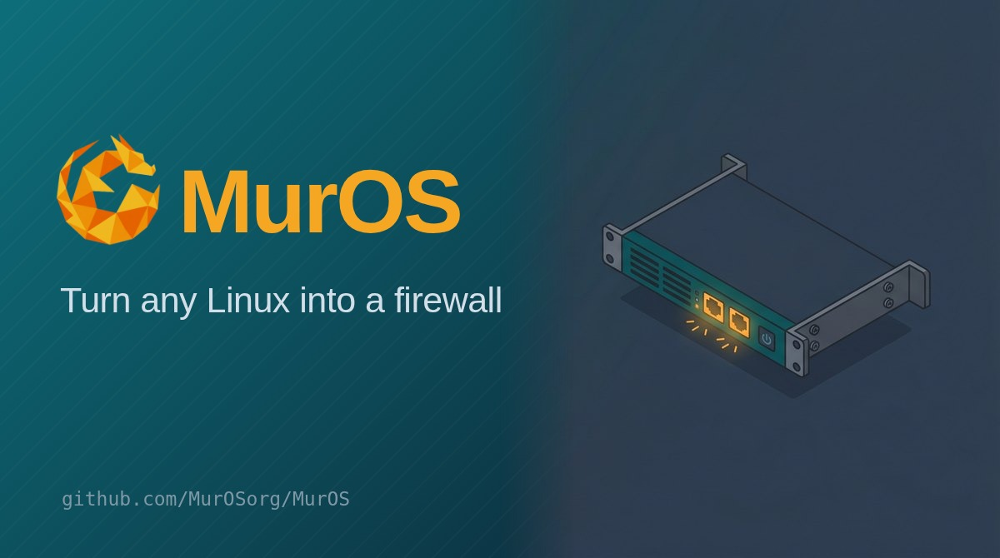

MurOS
=====

A web-managed open source firewall, rebuilt on Debian Linux. MurOS is an
OPNsense fork ported to Debian 13, a free, self-hosted alternative to pfSense
and commercial firewall appliances, with stateful filtering, NAT, routing, VPN
and high availability driven from the familiar OPNsense web interface.

MurOS is a fork of OPNsense that does more than swap an operating system.
The whole platform has been re-engineered to run natively on Debian 13: the
firewall data plane, the service supervisor, the package layer and the network
stack are all reworked around Linux primitives while keeping the OPNsense web
interface, configuration model and feature set that people already know.

What changes under the hood
---------------------------

The FreeBSD foundations of OPNsense are replaced with their Linux counterparts:

* Packet filtering moves from pf to nftables. The ruleset (filter, NAT,
  anti-lockout, logging) is generated from the same configuration and loaded
  through nft.
* Firewall state and connection tracking move from the pf state table to
  netfilter conntrack.
* Service supervision moves from rc and the FreeBSD init system to systemd
  units, with configd still acting as the control plane behind the web UI.
* The data plane moves from ifconfig and route to iproute2 (addresses, VLANs,
  bridges, lagg, tunnels, WireGuard, routing), with systemd-networkd handling
  declarative interface configuration and boot persistence.
* Software delivery moves from pkg and opnsense-update to apt and dpkg, served
  from a signed Debian repository.
* Logging moves from pflog to nftables log targets read back through journald.

The goal is not a temporary compatibility shim. Each subsystem is ported in
place so MurOS behaves like a first-class Linux firewall rather than a FreeBSD
appliance running elsewhere.

Status
------

MurOS is in beta. Stateful filtering, NAT, routing, multi-WAN gateway
monitoring, DHCP client WAN, the live firewall log, health graphs, packet
capture, diagnostics, the serial console and network hardening already run
natively on Linux. VPN service lifecycle, high availability, the DHCP and
recursive DNS server backends are still being ported. See the changelog and
feature pages on https://muros.org for the current state.

Install
-------

Two supported paths, both documented at https://muros.org :

Installer ISO (appliance):

    https://download.muros.org/iso/muros-installer-amd64.iso

On top of an existing Debian 13 system:

    curl -fsSL https://download.muros.org/install.sh | sudo bash

Then open https://<address>/ and log in with root / muros. Update later with:

    apt update && apt install --only-upgrade muros

Build from source
-----------------

MurOS keeps the OPNsense source layout. The Linux packaging lives under
debian/, and a Debian package is built with the standard tooling:

    dpkg-buildpackage -b -us -uc

The Makefile targets inherited from OPNsense (lint, style, sweep) remain useful
for working on the PHP MVC and Python code:

    make lint
    make style

The web interface combines legacy PHP pages with a Phalcon MVC application; the
backend control plane is the configd daemon driving the ported Python and shell
actions. The architecture is described at https://muros.org/docs .

Contribute
----------

Issues and pull requests are welcome. See [CONTRIBUTING.md](./CONTRIBUTING.md)
for how to report a problem or propose a change.

License
-------

MurOS is distributed under the 2-Clause BSD license, the same terms as the
OPNsense code it is based on:

https://opensource.org/licenses/BSD-2-Clause

OPNsense is a registered trademark of Deciso B.V. MurOS is an independent fork
and is not affiliated with or endorsed by Deciso B.V. Every contribution to
MurOS must be licensed under the same terms to keep the project free and open
for everybody.
